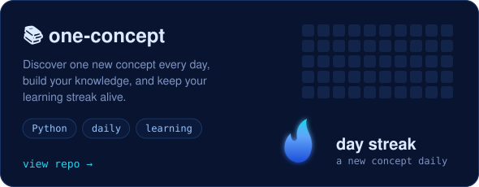
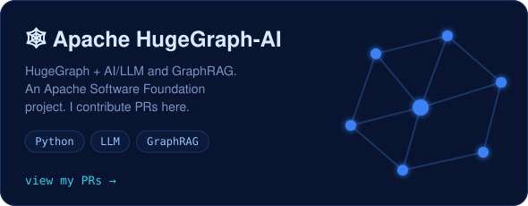

  

  

- 💻 Full-stack engineer: Next.js, GraphQL, Hasura and PostgreSQL. I like owning a feature end to end, from product idea to architecture.
- 🦀 Building **[Diskern](https://github.com/Coding-Moves/diskern)**, a disk cleaner that understands your computer instead of guessing.
- 🔁 **Triage collaborator** at **[drt-hub/drt](https://github.com/drt-hub/drt)**, a reverse ETL tool for the code-first data stack.
- 🧠 I love systems (Linux, containers, VMs), math, and AI tooling.
- 📖 Hafiz-e-Quran. I balance faith with my love for technology.

  
  

  

- [Jira connector with create/update support](https://github.com/drt-hub/drt/pull/236)
- [Connector registry for auto-discovery](https://github.com/drt-hub/drt/pull/380)
- [JSON Schema validation infrastructure](https://github.com/drt-hub/drt/pull/356)
- [Test validators: freshness, unique, accepted_values](https://github.com/drt-hub/drt/pull/357)
- [Dry-run row count diff for replace mode](https://github.com/drt-hub/drt/pull/361)

➡️ [All my drt PRs](https://github.com/drt-hub/drt/pulls?q=is%3Apr+author%3AMuawiya-contact)

  
  

  

  

  <picture>
    <source media="(prefers-color-scheme: dark)" srcset="https://raw.githubusercontent.com/Muawiya-contact/Muawiya-contact/output/github-snake-dark.svg">
    <source media="(prefers-color-scheme: light)" srcset="https://raw.githubusercontent.com/Muawiya-contact/Muawiya-contact/output/github-snake.svg">
    
  </picture>

